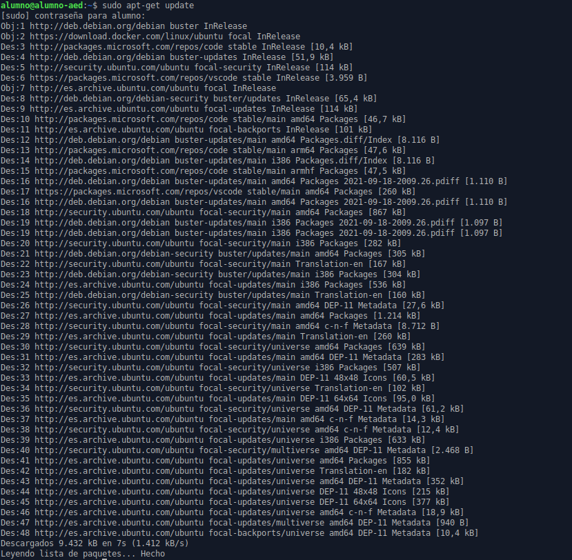

# Instalación de JDK en Ubuntu

## Introducción

Repositorio dedicado a la instalación de OpenJDK en Ubuntu.

## ¿Cómo instalar Java en Ubuntu desde repositorios?

Instalación

## Imagen de Internet

