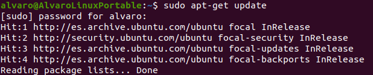
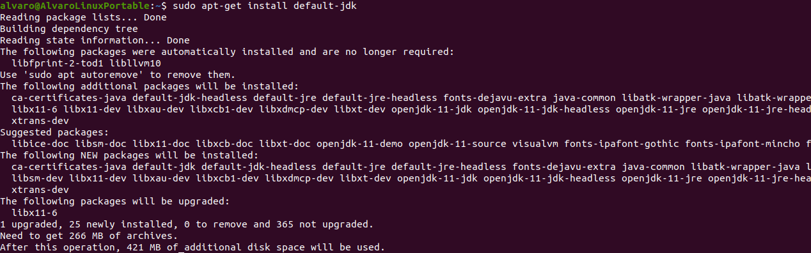
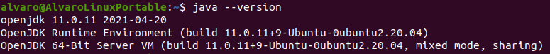
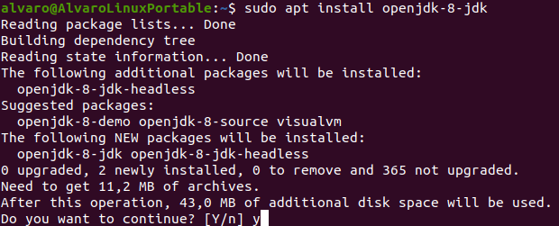
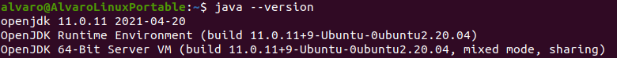
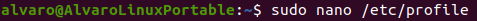
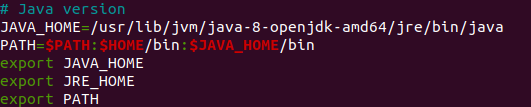
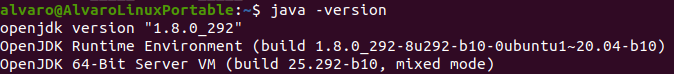

# Instalación de JDK en Ubuntu

## Introducción

Repositorio dedicado a la instalación de OpenJDK en Ubuntu.

## 1.-¿Cómo instalar Java en Ubuntu desde repositorios?

Lo primero será actualizar los repositorios del sistema:

Ahora instalamos la versión de java por defecto:

Vemos que se ha instalado la version 11.0.11, pero nosotros trabajaremos con la 8.

## 2.-¿Cómo instalar una versión específica de Java?

Para instalar la versión 8 de Ubuntu Java Open JDK tendremos que ejecutar el siguiente comando:

Comprobamos que aún aparece que la versión instalada es la 11.0.11.

Por lo que tendremos que configurar las variables de entorno

## 3.-¿Cómo instalar una versión específica de Java?

Tenemos que editar el archivo “/etc/profile”, para ello utilizaremos el editor de texto Nano.

Una vez abierto el archivo añadimos lo siguiente:

Vemos que, si ahora ejecutamos “java -version” sí que aparece la versión 1.8.

